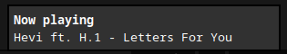
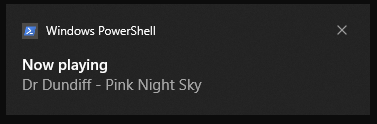

# Lofi Girl Scrobbler 🎧 - Client 

## Features

- Standalone - When activated, it allows serverless execution of the system. As it is previously stated, it requires opencv/tesseract dependencies to be available system wide.
- Notify - When activated, it provides notification support for three operating systems linux, windows and macos.

    example on Linux with mako on Sway:

    

    example on Windows:
    
    

## Compiling

### Default client

```
cargo build --release
```

To compile only the client module in the workspace use ```-p``` flag.

```
cargo build --release -p lofigirl
```

### Standalone

```
cargo build --release --features standalone
```

### With notification support

```
cargo build --release --features notify
```

## Example Config file

```toml
[lastfm] # optional - choose one or both
username = "username" # will be removed after first run and turned into session_key 
password = "password" # will be removed after first run and turned into session_key

[lastfm_api] #optional for standalone. Normal client uses the server side api key.
api_key = "api_key"
api_secret = "api_secret"

[listenbrainz] # optional - choose one or both
token = "token"

[server] # Standalone would not need this section
link = "http://127.0.0.1:8080"
```

You might keep have other config fields in your config files which will be ignored.

## Usage

```
Scrobble the tracks you listen on lofigirl streams

Usage: lofigirl_client [OPTIONS] --url <URL>

Options:
  -c, --config <CONFIG>  Configuration toml file [default: config.toml]
  -u, --url <URL>        LofiGirl Youtube stream URL
  -h, --help             Print help
  -V, --version          Print version
```

Example:

```bash
lofigirl_client -u "https://www.youtube.com/watch?v=XXX"
```  