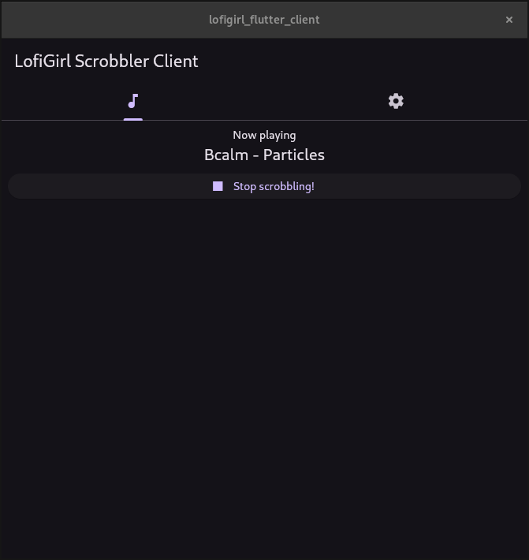

# Lofi Girl Scrobbler 🎧 - Flutter Client

Flutter frontend for the lofigirl server component.

## Get Started

Check releases for the native builds. 

If you want to play around with the git version of the frontend:

```
flutter pub get
flutter run
```

To build release version

```
flutter build <platform>
```

## Usage

Sharing ideas from the rust wasm web client, flutter client has two page views: main and settings.

- Initial home page:


- Initial settings page:


- Filling the settings:


- After connected to the server:


- Scrobbling to LastFM and ListenBrainz:




