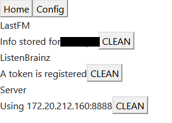
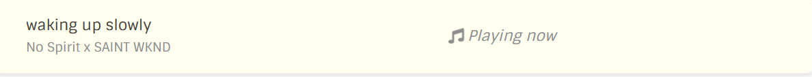

# Lofi Girl Scrobbler 🎧 - Frontend Client 

Written in rust using [seed-rs](https://seed-rs.org/) with zero js. Based on https://github.com/seed-rs/seed-quickstart

## Compiling

Requires cargo-make

```
cargo install cargo-make
```

Frontend can be compiled separately by

```
cargo make build_release
```

## Usage

Deploy index.html with pkg folder or host it with a simple http server

- Home


- Config


- Config with some parameters



- Listening


