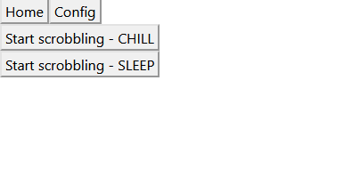
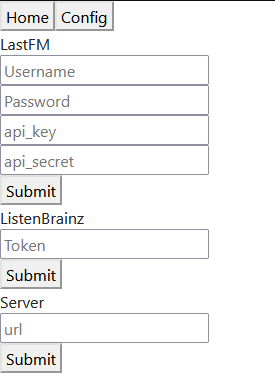
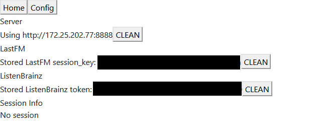
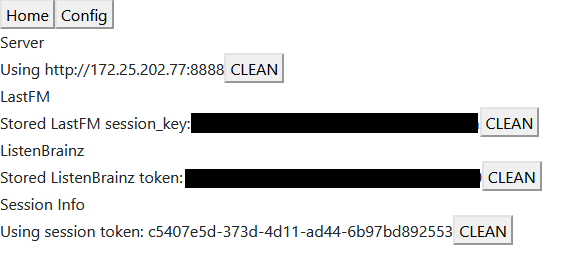
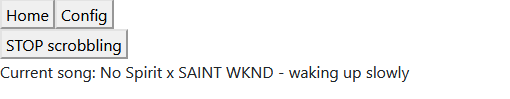

# Lofi Girl Scrobbler 🎧 - Frontend Client 

Written in rust using [seed-rs](https://seed-rs.org/) with no additional javascript. Based on https://github.com/seed-rs/seed-quickstart

## Compiling

Requires cargo-make

```
cargo install cargo-make
```

Frontend can be compiled separately by

```
cargo make build_release
```

## Usage

Deploy index.html with pkg folder or host it with a simple http server

- Home



- Config



Fill the server information first. OUpon submitting the server information, the system checks if the server is reachable and only stores the server information on success.

- Config with some parameters



When you fill your LastFM details, it sends the username/password information to server side for one time only to request a permanent LastFM session key (server information should be already filled out). This session key is sent back to the web client and used for sending track listening. The system does not store your password details at any point.

- Config with Session Token



Instead of sending LastFM session key and/or ListenBrainz token on every single request, the system uses a session token system which is generated on first listening event. The server stores your LastFM session key and/or ListenBrainz token attached to the this app's session token. You can check the server side [table schema](../migrations/20210525000135_table.sql) to have a more detailed look.

- Listening


