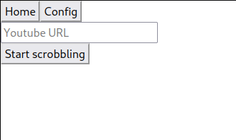

# Lofi Girl Scrobbler 🎧 - Frontend Client 

Written in rust using [seed-rs](https://seed-rs.org/) compiled to wasm. Based on https://github.com/seed-rs/seed-quickstart

It follows the `The Elm Architecture` or `Model-View-Update` (`MVU`) principle for a frontend UI. It's very barebones without any styling but it demonstrates the capability of generating a functional wasm frontend using `Rust` and it benefits from reusing shared types and functionality in the project ecosystem.

## Compiling

Requires cargo-make

```
cargo install cargo-make
```

Frontend can be compiled separately by

```
cargo make build_release
```

## Usage

Deploy index.html with pkg folder or host it with a simple http server

### Empty Home Page



### Empty Config Page


Fill the server information first. OUpon submitting the server information, the system checks if the server is reachable and only stores the server information on success.

### Config with some parameters


When LastFM details are filled, it sends the username/password information to server side for one time only to request a permanent LastFM session key (server information should be already filled out). This lastfm session key is sent back to the web client and used for sending track listening. The system does not store your password details at any point.

### Config with Session Token


Instead of sending LastFM session key and/or ListenBrainz token on every single request, the system uses a session token system which is generated on first listening event. The server stores your LastFM session key and/or ListenBrainz token attached to the this app's session token. You can check the server side [table schema](../migrations/20210525000135_table.sql) to have a more detailed look.

### Home Page on Listening


When starting scrobbling, the web client establishes a websocket connection and listens track changes events. When a track changes occur, the web client send listening info via already pre-established REST endpoint.

- Example on listenbrainz

